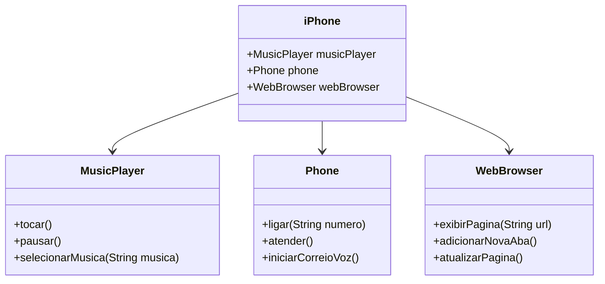

# iPhone Android App - Desafio de código

## Descrição
Este é um script de treinamento desenvolvido para praticar conceitos de Programação Orientada a Objetos (POO) em Java, aplicados ao desenvolvimento de aplicativos Android. O projeto modela e implementa um componente iPhone com funcionalidades de Reprodutor Musical, Aparelho Telefônico e Navegador na Internet.
Decidi aprender como funciona alguns conceitos de android também, dado que não consigo fazer nada simples rsrsrs.

## Tecnologias Utilizadas
- Java
- Android SDK
- Gradle
- UML (Utilizando Mermaid para o diagrama)

## Funcionalidades
### Reprodutor Musical
- `tocar()`
- `pausar()`
- `selecionarMusica(String musica)`

### Aparelho Telefônico
- `ligar(String numero)`
- `atender()`
- `iniciarCorreioVoz()`

### Navegador na Internet
- `exibirPagina(String url)`
- `adicionarNovaAba()`
- `atualizarPagina()`

## Estrutura do Projeto

```
Projeto/
│
├── app/
│ ├── src/
│ │ ├── main/
│ │ │ ├── java/
│ │ │ │ ├── com/
│ │ │ │ │ └── dio/
│ │ │ │ │ └── iphone/
│ │ │ │ │ ├── MainActivity.java
│ │ │ │ │ ├── interfaces/
│ │ │ │ │ │ ├── MusicPlayer.java
│ │ │ │ │ │ ├── Phone.java
│ │ │ │ │ │ └── WebBrowser.java
│ │ │ │ │ ├── models/
│ │ │ │ │ │ └── iPhone.java
│ │ │ │ │ ├── services/
│ │ │ │ │ │ ├── MusicService.java
│ │ │ │ │ │ ├── PhoneService.java
│ │ │ │ │ │ └── WebService.java
│ │ │ │ │ └── utils/
│ │ │ │ │ └── DataSanitizer.java
```

## Diagrama UML



## Perguntas e o que foi aprendido:
1. **O que é uma `Activity` no contexto do Android?**
   - Uma `Activity` é um componente central no desenvolvimento Android que representa uma única tela com uma interface de usuário. Cada `Activity` é uma entrada no arquivo `AndroidManifest.xml` e pode ser iniciada a partir de outras `Activities` ou aplicativos. Ela gerencia a interação do usuário com a interface e responde aos eventos do ciclo de vida, como criação, pausa e destruição.

2. **Como funciona o ciclo de vida de uma `Activity`?**
   - O ciclo de vida de uma `Activity` inclui estados e métodos de callback que são invocados pelo sistema Android conforme a `Activity` é criada, iniciada, pausada, retomada e destruída. Métodos chave incluem `onCreate()`, `onStart()`, `onResume()`, `onPause()`, `onStop()`, `onDestroy()`, e `onRestart()`. Entender e gerenciar corretamente esses estados é crucial para garantir uma experiência de usuário suave e a eficiência do uso de recursos.

3. **O que são interfaces em Java e qual a sua utilidade?**
   - Interfaces em Java são contratos que definem um conjunto de métodos que uma classe deve implementar. Elas são usadas para especificar comportamentos que podem ser implementados por classes diferentes de maneiras distintas. Interfaces suportam a abstração e a programação orientada a interfaces, promovendo a flexibilidade e a reutilização de código.

4. **Como implementar uma interface em Java?**
   - Para implementar uma interface em Java, uma classe deve usar a palavra-chave `implements` seguida pelo nome da interface. A classe deve fornecer implementações para todos os métodos definidos na interface. Se a classe não implementar todos os métodos, ela deve ser declarada como `abstract`.

5. **O que é um `WebView` no Android e para que ele é utilizado?**
   - `WebView` é uma classe no Android que permite exibir conteúdo web dentro de uma aplicação Android. Ele funciona como um navegador embutido, renderizando páginas HTML e executando JavaScript. `WebView` é utilizado para integrar funcionalidades web sem sair do ambiente do aplicativo.

6. **Qual a importância da classe `WebViewClient` em um `WebView`?**
   - `WebViewClient` é uma classe que permite personalizar o comportamento de um `WebView`. Ao definir um `WebViewClient`, é possível interceptar eventos de navegação, controlar o carregamento de páginas e definir ações específicas, como abrir links dentro do próprio `WebView` ao invés de um navegador externo.

7. **Como são gerenciadas permissões no Android?**
   - Permissões no Android são gerenciadas declarando-as no arquivo `AndroidManifest.xml` e, a partir do Android 6.0 (API nível 23), solicitando-as em tempo de execução. Os usuários devem conceder ou negar permissões através de caixas de diálogo, e o desenvolvedor deve verificar e tratar a resposta do usuário adequadamente.

8. **O que são arquivos de recurso (`res`) em um projeto Android?**
   - Arquivos de recurso em um projeto Android são utilizados para definir aspectos não programáticos da aplicação, como layouts de interface de usuário, strings, cores, dimensões, imagens e outros recursos. Eles são organizados em pastas específicas dentro do diretório `res` e referenciados no código Java ou XML.

9. **Como é estruturado um arquivo `AndroidManifest.xml`?**
   - O arquivo `AndroidManifest.xml` é o arquivo de configuração principal de um aplicativo Android. Ele declara a estrutura da aplicação, incluindo todas as `Activities`, serviços, receptores de broadcast e provedores de conteúdo. Além disso, define permissões, configurações de hardware e versões do SDK alvo e mínima.

10. **Qual a função do método `setJavaScriptEnabled` em um `WebView`?**
    - O método `setJavaScriptEnabled` permite ou desabilita a execução de JavaScript em um `WebView`. Como JavaScript é frequentemente usado em páginas web, habilitá-lo permite que o `WebView` execute scripts, melhorando a funcionalidade e interatividade das páginas exibidas.

11. **O que é a classe `Context` no Android e como ela é utilizada?**
    - A classe `Context` no Android fornece acesso a recursos e serviços globais da aplicação, como acesso a recursos, bancos de dados, preferências compartilhadas e serviços de sistema. É frequentemente passada para componentes que precisam acessar esses recursos ou executar operações contextuais.

12. **Como se define a versão mínima do SDK no arquivo de configuração do Gradle?**
    - A versão mínima do SDK é definida no arquivo de configuração do Gradle (`build.gradle`) usando a propriedade `minSdkVersion` dentro do bloco `defaultConfig`. Isso especifica a versão mínima do Android necessária para executar a aplicação.

13. **Qual a diferença entre `minSdkVersion` e `targetSdkVersion`?**
    - `minSdkVersion` especifica a versão mínima do Android necessária para instalar e executar o aplicativo, enquanto `targetSdkVersion` indica a versão do SDK com a qual a aplicação foi testada e está otimizada. `targetSdkVersion` não limita a instalação, mas pode afetar o comportamento do aplicativo em versões mais recentes.

14. **Como se adicionam dependências em um projeto Gradle?**
    - Dependências são adicionadas no arquivo `build.gradle` dentro do bloco `dependencies`. Cada dependência é especificada com o formato `implementation 'group:name:version'` para incluir bibliotecas externas necessárias para o desenvolvimento e execução do aplicativo.

15. **O que é a anotação `@Override` e quando ela é utilizada?**
    - A anotação `@Override` é usada em Java para indicar que um método está sobrescrevendo um método da superclasse ou implementando um método de uma interface. Ela melhora a legibilidade do código e ajuda a evitar erros, garantindo que o método na superclasse exista.

16. **Como se define um layout XML para uma `Activity` no Android?**
    - Um layout XML para uma `Activity` é definido em um arquivo XML dentro do diretório `res/layout`. Esse arquivo descreve a estrutura da interface de usuário usando elementos de layout e widgets. O layout é então associado à `Activity` no método `onCreate()` usando `setContentView(R.layout.layout_name)`.

17. **O que é um `RelativeLayout` e quais são suas características?**
    - `RelativeLayout` é um gerenciador de layout no Android que permite posicionar elementos relativos uns aos outros ou ao contêiner pai. Com `RelativeLayout`, é possível alinhar, centralizar e ajustar elementos dinamicamente com base em relações especificadas, oferecendo flexibilidade no design de interfaces.

18. **O que são as `Proguard rules` e qual a sua função?**
    - `Proguard rules` são configurações usadas pelo Proguard, uma ferramenta de otimização e ofuscação de código. Elas controlam como o código é reduzido, otimizado e ofuscado para dificultar a engenharia reversa, melhorar a performance e reduzir o tamanho do aplicativo.

19. **Como implementar métodos de uma interface em uma classe concreta?**
    - Para implementar métodos de uma interface em uma classe concreta, a classe deve declarar que implementa a interface usando a palavra-chave `implements` e fornecer implementações concretas para todos os métodos definidos na interface. A classe não pode ser instanciada se não implementar todos os métodos da interface.

20. **O que é um método `static` em Java e como ele é utilizado?**
    - Um método `static` em Java pertence à classe em vez de a uma instância específica da classe. Ele pode ser chamado sem criar um objeto da classe. Métodos `static` são usados para operações que não dependem de dados de instância, como funções utilitárias ou métodos de fábrica.

21. **Qual a diferença entre `public`, `private` e `protected` em Java?**
    - `public` torna um membro acessível de qualquer lugar, `private` restringe o acesso a dentro da própria classe, e `protected` permite o acesso dentro da mesma classe, classes do mesmo pacote e subclasses. Esses modificadores controlam a visibilidade e encapsulamento dos membros da classe.

22. **O que é a classe `MediaPlayer` e como ela é utilizada no Android?**
    - `MediaPlayer` é uma classe do Android que gerencia a reprodução de arquivos de áudio e vídeo. Ela fornece métodos para controlar a reprodução, como `start()`, `pause()`, `stop()`, e configurar fontes de mídia. `MediaPlayer` é usada para integrar funcionalidades de reprodução de mídia em aplicativos.

23. **Como funciona a estrutura de pacotes em Java?**
    - A estrutura de pacotes em Java organiza classes e interfaces em namespaces, facilitando o gerenciamento de grandes projetos. Pacotes são definidos usando a palavra-chave `package` no início do arquivo de código-fonte, e as classes são importadas de outros pacotes usando `import`.

24. **O que é a classe `PhoneService` e qual a sua responsabilidade?**
    - `PhoneService` é uma classe de serviço personalizada no Android que encapsula funcionalidades relacionadas a operações telefônicas, como fazer e atender chamadas. Ela gerencia a lógica necessária para interagir com o sistema de telefonia do dispositivo e fornece uma interface simples para essas operações.

25. **Como criar um novo `Intent` no Android?**
    - Um `Intent` é criado no Android usando o construtor `Intent(Context, Class<?>)`, onde `Context` é o contexto atual e `Class<?>` é a classe da `Activity` ou `Service` a ser iniciado. `Intents` são usados para iniciar `Activities`, `Services` e transmitir eventos entre componentes.

26. **Qual a função do arquivo `strings.xml` em um projeto Android?**
    - O arquivo `strings.xml` dentro do diretório `res/values` armazena strings de texto utilizadas na aplicação. Ele facilita a localização e a manutenção do texto, permitindo a separação do conteúdo textual da lógica do aplicativo e suportando traduções e diferentes localizações.

27. **Como se define um método abstrato em uma interface?**
    - Métodos abstratos em uma interface são definidos sem corpo, apenas com a assinatura do método. Em Java, todos os métodos em uma interface são implicitamente abstratos e públicos, então a palavra-chave `abstract` é opcional. As classes que implementam a interface devem fornecer implementações concretas para esses métodos.

28. **O que é um `Service` no Android e como ele difere de uma `Activity`?**
    - Um `Service` no Android é um componente que executa operações em segundo plano sem interação com o usuário. Diferente de uma `Activity`, que possui uma interface de usuário, um `Service` continua rodando mesmo quando a aplicação está em segundo plano, ideal para tarefas de longa duração.

29. **Qual a importância da função `onCreate` em uma `Activity`?**
    - O método `onCreate` é a primeira função chamada quando uma `Activity` é criada. Ele é usado para inicializar a `Activity`, configurar a interface de usuário com `setContentView`, e realizar outras operações de configuração necessárias. É um ponto chave no ciclo de vida da `Activity`.

30. **O que é e como funciona a classe `Call` no pacote `android.telecom`?**
    - A classe `Call` no pacote `android.telecom` representa uma chamada telefônica. Ela fornece métodos para gerenciar o estado da chamada, como atender, finalizar e colocar em espera. `Call` é usada em aplicativos que precisam interagir com a funcionalidade de chamadas do dispositivo.
