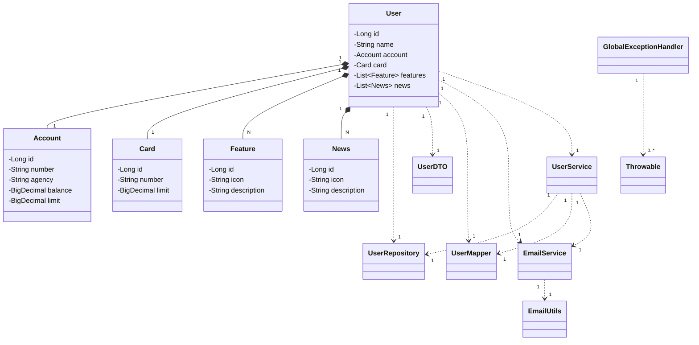

# DIO Banking Application API

Projeto proposto pela [Digital Innovation One](https://www.dio.me) (DIO) para um aprofundamento de Java usando o Spring Boot. O objetivo é a aplicação do Spring no uso de APIs, onde melhorei um pouco o projeto original que pode ser encontrado [aqui](https://github.com/digitalinnovationone/santander-dev-week-2023-api/tree/main)

## O que foi aplicado e estudado

No desenvolvimento deste projeto, foram aplicados e estudados os seguintes conceitos:

- **Spring Boot**: Utilizado para construir a aplicação de forma rápida e eficiente.
- **JPA/Hibernate**: Utilizado para o mapeamento objeto-relacional (ORM) e manipulação do banco de dados.
- **Programação Orientada a Objetos**: Implementação de conceitos como abstração, encapsulamento, herança e polimorfismo.
- **Testes unitários**: Criação de testes para garantir a funcionalidade correta dos serviços utilizando Mockito.
- **Envio de Email**: Utilização do `JavaMailSender` para envio de emails de boas-vindas aos usuários cadastrados.
- **Tratamento Global de Exceções**: Implementação de um handler global para tratar exceções.
- **Multi-threading**: Configuração de suporte a múltiplas threads.
- **Arquitetura MVC**: Separação clara entre modelos, controladores e serviços.

## Estrutura de Diretórios

```
src
├── main
│ ├── com
│ │ ├── dio
│ │ │ ├── api
│ │ │ │ ├── Application.java
│ │ │ │ ├── config
│ │ │ │ │ ├── SecurityConfig.java
│ │ │ │ │ ├── ThreadConfig.java
│ │ │ │ ├── controller
│ │ │ │ │ ├── UserController.java
│ │ │ │ │ └── exception
│ │ │ │ │ ├── GlobalExceptionHandler.java
│ │ │ │ ├── domain
│ │ │ │ │ ├── model
│ │ │ │ │ │ ├── Account.java
│ │ │ │ │ │ ├── BaseItem.java
│ │ │ │ │ │ ├── Card.java
│ │ │ │ │ │ ├── Feature.java
│ │ │ │ │ │ ├── News.java
│ │ │ │ │ │ ├── User.java
│ │ │ │ │ ├── repository
│ │ │ │ │ │ ├── UserRepository.java
│ │ │ │ ├── dto
│ │ │ │ │ ├── UserDTO.java
│ │ │ │ ├── mapper
│ │ │ │ │ ├── UserMapper.java
│ │ │ │ ├── service
│ │ │ │ │ ├── EmailService.java
│ │ │ │ │ ├── UserService.java
│ │ │ │ ├── util
│ │ │ │ │ ├── EmailUtils.java
│ ├── resources
│ │ ├── application.properties
│ │ ├── static
│ │ ├── templates
│ │ ├── messages.properties
└── test
├── com
│ ├── dio
│ │ ├── api
│ │ │ ├── service
│ │ │ │ ├── UserServiceTest.java
│ │ │ │ ├── EmailServiceTest.java
├── resources
├── application-test.properties
```

## Descrição das Classes

### Main Application
- **Application.java**: Classe principal que inicializa a aplicação Spring Boot.

### Configuração
- **SecurityConfig.java**: Configurações de segurança para a aplicação.
- **ThreadConfig.java**: Configurações para suporte a multi-threading.

### Controladores
- **UserController.java**: Controlador responsável por expor endpoints relacionados aos usuários.
- **GlobalExceptionHandler.java**: Classe para tratamento global de exceções.

### Domínio
- **Account.java**: Representa a entidade conta bancária.
- **BaseItem.java**: Classe base para outras entidades.
- **Card.java**: Representa a entidade cartão.
- **Feature.java**: Representa características adicionais de um usuário.
- **News.java**: Representa notícias ou anúncios para o usuário.
- **User.java**: Representa a entidade usuário.
- **UserRepository.java**: Interface JPA para operações com a entidade User.

### DTO
- **UserDTO.java**: Data Transfer Object para a entidade User.

### Mapper
- **UserMapper.java**: Mapeia entre User e UserDTO.

### Serviços
- **EmailService.java**: Serviço responsável pelo envio de emails.
- **UserService.java**: Serviço responsável pela lógica de negócios relacionada aos usuários.

### Utilitários
- **EmailUtils.java**: Classe utilitária para criação de mensagens de email.

### Testes
- **UserServiceTest.java**: Testes unitários para o serviço de usuários.
- **EmailServiceTest.java**: Testes unitários para o serviço de email.

## Diagrama UML

Aqui está o diagrama UML representando os relacionamentos entre as classes da aplicação:



# Perguntas e Respostas sobre o Projeto DIO Banking Application

## 1. O que é o Spring Boot e por que é usado em projetos Java?

**Resposta:** O Spring Boot é um framework de desenvolvimento para aplicações Java que simplifica o processo de configuração e inicialização de novos projetos. Ele oferece uma configuração automática e uma abordagem baseada em convenções, o que reduz a quantidade de configuração manual e permite que os desenvolvedores criem aplicações rapidamente. É usado para criar aplicações stand-alone, baseadas em Spring, com suporte a recursos como gerenciamento de dependências e configuração automática.

## 2. O que é JPA e como ele ajuda no desenvolvimento de aplicações Java?

**Resposta:** JPA (Java Persistence API) é uma especificação Java para o gerenciamento de dados relacionais em aplicações. Ele fornece uma interface padrão para mapeamento objeto-relacional e operações CRUD em bancos de dados. JPA ajuda a abstrair a complexidade das interações com o banco de dados e simplifica o gerenciamento de entidades e suas relações.

## 3. Qual é a função do `@Entity` em uma classe Java?

**Resposta:** A anotação `@Entity` é usada para marcar uma classe Java como uma entidade JPA que deve ser mapeada para uma tabela do banco de dados. Classes anotadas com `@Entity` são persistidas no banco de dados, e suas instâncias podem ser manipuladas através de operações CRUD usando um EntityManager ou Repository.

## 4. O que faz o `@RestController` em um controlador Spring Boot?

**Resposta:** A anotação `@RestController` combina `@Controller` e `@ResponseBody`, o que indica que a classe é um controlador Spring MVC e que os métodos retornam diretamente os dados para o cliente, em vez de visualizar uma página. É usada para criar APIs RESTful que retornam dados JSON ou XML.

## 5. Qual é a importância de `@ExceptionHandler` em um controlador Spring Boot?

**Resposta:** A anotação `@ExceptionHandler` define métodos que capturam exceções lançadas pelos métodos do controlador. É importante para centralizar o tratamento de erros e fornecer respostas consistentes e apropriadas para diferentes tipos de exceções, melhorando a robustez e a manutenção do código.

## 6. O que é uma DTO e por que você a utilizaria em um projeto?

**Resposta:** DTO (Data Transfer Object) é um padrão de design que encapsula dados para transferência entre camadas de uma aplicação. É usado para transportar dados entre a camada de persistência e a camada de apresentação, garantindo que apenas os dados necessários sejam expostos e permitindo a transformação dos dados conforme necessário.

## 7. Como o `@Autowired` ajuda na injeção de dependências em Spring Boot?

**Resposta:** A anotação `@Autowired` permite que o Spring Boot injete automaticamente instâncias de dependências em componentes, como controladores e serviços. Ela reduz a necessidade de criar instâncias manualmente e promove um design baseado em injeção de dependências, o que melhora a modularidade e testabilidade do código.

## 8. O que é o padrão de design Singleton e como ele é implementado no Spring Boot?

**Resposta:** O padrão Singleton garante que uma classe tenha apenas uma instância e forneça um ponto global de acesso a essa instância. No Spring Boot, o padrão Singleton é implementado automaticamente para beans, a menos que uma configuração diferente seja especificada, garantindo que a mesma instância seja usada em toda a aplicação.

## 9. O que é a anotação `@Service` e qual é o seu propósito?

**Resposta:** A anotação `@Service` marca uma classe como um componente de serviço em Spring Boot. Ela indica que a classe contém a lógica de negócios da aplicação e é gerenciada pelo Spring Container, permitindo que seja injetada em outros componentes e facilitando a organização do código.

## 10. Como você pode criar e configurar um perfil de teste no Spring Boot?

**Resposta:** Para criar um perfil de teste no Spring Boot, você pode definir um arquivo `application-test.properties` ou `application-test.yml` no diretório `src/test/resources`. Esse arquivo contém configurações específicas para o ambiente de teste, permitindo a personalização das configurações sem afetar o ambiente de produção.

## 11. O que é o `@Component` e como ele se diferencia do `@Service`?

**Resposta:** A anotação `@Component` é uma generalização para qualquer bean gerenciado pelo Spring Container. `@Service` é uma especialização de `@Component` com uma semântica mais específica, indicando que a classe contém lógica de negócios. Ambos são usados para injeção de dependências, mas `@Service` é mais semântico para serviços de negócios.

## 12. Como você pode configurar a segurança em uma aplicação Spring Boot?

**Resposta:** A segurança em uma aplicação Spring Boot pode ser configurada usando a anotação `@Configuration` e implementando a classe `SecurityConfig`, que estende `WebSecurityConfigurerAdapter`. Nessa classe, você define regras de autenticação, autorização, e outras configurações relacionadas à segurança da aplicação.

## 13. O que é o padrão de design Repository e qual é sua função no Spring Boot?

**Resposta:** O padrão Repository fornece uma camada de abstração para operações de acesso a dados e manipulação de entidades. No Spring Boot, você pode criar interfaces que estendem `JpaRepository` ou `CrudRepository` para fornecer operações CRUD e consultas personalizadas, facilitando a interação com o banco de dados.

## 14. Como você pode garantir que a comunicação com o banco de dados seja segura e eficiente?

**Resposta:** Para garantir uma comunicação segura e eficiente com o banco de dados, você deve usar práticas como criptografia para dados sensíveis, parâmetros de configuração adequados para o pool de conexões, e consultas otimizadas para evitar SQL Injection e melhorar o desempenho.

## 15. O que são testes unitários e por que são importantes para um projeto Java?

**Resposta:** Testes unitários verificam individualmente o comportamento de componentes ou métodos específicos em uma aplicação. Eles são importantes para garantir que o código funcione como esperado, identificar problemas precocemente e facilitar a manutenção e refatoração do código.

## 16. Qual é a função da classe `GlobalExceptionHandler` no projeto?

**Resposta:** A classe `GlobalExceptionHandler` é responsável por capturar e tratar exceções não tratadas lançadas pelos controladores. Ela fornece uma maneira centralizada de lidar com erros e garantir que respostas consistentes sejam enviadas ao cliente, melhorando a robustez e a experiência do usuário.

## 17. O que é o padrão de design Builder e como ele pode ser usado em Java?

**Resposta:** O padrão Builder é um padrão de design que separa a construção de um objeto complexo de sua representação, permitindo a criação de diferentes representações de um objeto usando o mesmo processo de construção. Em Java, ele é implementado com uma classe `Builder` aninhada e métodos de configuração encadeados.

## 18. O que são anotações em Java e como elas são usadas no Spring Boot?

**Resposta:** Anotações em Java são metadados que fornecem informações sobre o código e podem ser usadas pelo compilador e runtime. No Spring Boot, anotações como `@Component`, `@Service`, e `@Repository` definem comportamentos e configuram aspectos do framework, facilitando o desenvolvimento e a configuração da aplicação.

## 19. Como você pode criar e usar um serviço de email em uma aplicação Spring Boot?

**Resposta:** Para criar um serviço de email em Spring Boot, você pode configurar um `JavaMailSender` com as propriedades do servidor de email e criar uma classe de serviço que utilize o `JavaMailSender` para enviar emails. O serviço deve ser configurado com informações como host, porta e credenciais.

## 20. O que é um `Data Transfer Object` (DTO) e por que ele é utilizado?

**Resposta:** Um DTO é um objeto que carrega dados entre processos, geralmente para transferir informações entre a camada de serviço e a camada de apresentação. Ele ajuda a desacoplar as camadas da aplicação, garantindo que apenas os dados necessários sejam expostos e facilitando a transformação de dados.

## 21. Como a injeção de dependência melhora a testabilidade do código?

**Resposta:** A injeção de dependência permite a substituição de dependências por mocks ou stubs em testes, sem modificar a classe em teste. Isso melhora a testabilidade, pois facilita o isolamento das unidades de código e permite testar cada componente de forma independente.

## 22. O que é um `@Transactional` e como ele é usado em métodos de serviço?

**Resposta:** A anotação `@Transactional` define que um método ou classe deve ser executado em um contexto de transação. Em métodos de serviço, ela garante que todas as operações de banco de dados dentro do método sejam realizadas em uma única transação, que será confirmada ou revertida.

## 23. Como você pode definir e usar perfis no Spring Boot?

**Resposta:** Perfis no Spring Boot permitem a configuração de diferentes ambientes de execução, como desenvolvimento, teste e produção. Você pode definir perfis em arquivos de propriedades e ativar um perfil usando a propriedade `spring.profiles.active`, ajustando a configuração da aplicação para diferentes ambientes.

## 24. O que é a anotação `@MappedSuperclass` e qual é sua finalidade?

**Resposta:** A anotação `@MappedSuperclass` é usada para criar uma superclasse que pode ser estendida por outras entidades JPA. Ela permite que propriedades comuns, como `id`, `icon`, e `description`, sejam compartilhadas entre diferentes entidades sem serem mapeadas diretamente para tabelas no banco de dados.

## 25. Como você pode garantir que a API RESTful segue as melhores práticas?

**Resposta:** Para garantir que uma API RESTful siga as melhores práticas, você deve usar métodos HTTP apropriados (`GET`, `POST`, `PUT`, `DELETE`), definir endpoints claros e intuitivos, garantir a consistência nas respostas, usar códigos de status HTTP corretos e documentar a API para facilitar o uso por outros desenvolvedores.

## 26. O que é um repositório em Spring Data JPA e como ele é utilizado?

**Resposta:** Um repositório em Spring Data JPA é uma interface que fornece métodos para realizar operações CRUD e consultas personalizadas em entidades. Ele é usado para abstrair o acesso aos dados, oferecendo uma maneira simples e eficaz de interagir com o banco de dados.

## 27. O que são `fetch types` e qual é a diferença entre `EAGER` e `LAZY`?

**Resposta:** `Fetch types` definem como as associações entre entidades são carregadas do banco de dados. `EAGER` carrega as associações imediatamente com a entidade, enquanto `LAZY` carrega as associações somente quando acessadas, permitindo otimizações de desempenho.

## 28. Como você pode implementar uma estratégia de cache em uma aplicação Spring Boot?

**Resposta:** Para implementar uma estratégia de cache, você pode usar a anotação `@Cacheable` em métodos que retornam dados que podem ser cacheados. É necessário configurar um `CacheManager` e escolher uma implementação de cache, como `ConcurrentMapCacheManager` ou `RedisCacheManager`, dependendo das necessidades da aplicação.

## 29. O que é um `@ControllerAdvice` e qual é o seu propósito?

**Resposta:** `@ControllerAdvice` é uma anotação usada para definir uma classe que pode fornecer tratamento global para exceções, vincular dados comuns a todos os controladores e configurar comportamentos globais. É usado para aplicar lógica a todas as requisições, sem precisar duplicar código em cada controlador.

## 30. Como você pode garantir que os emails enviados pela aplicação sejam confiáveis e seguros?

**Resposta:** Para garantir que os emails sejam confiáveis e seguros, você deve configurar corretamente o servidor de email com autenticação segura, usar TLS para a comunicação, validar endereços de email para evitar spam e proteger informações sensíveis no corpo dos emails.

