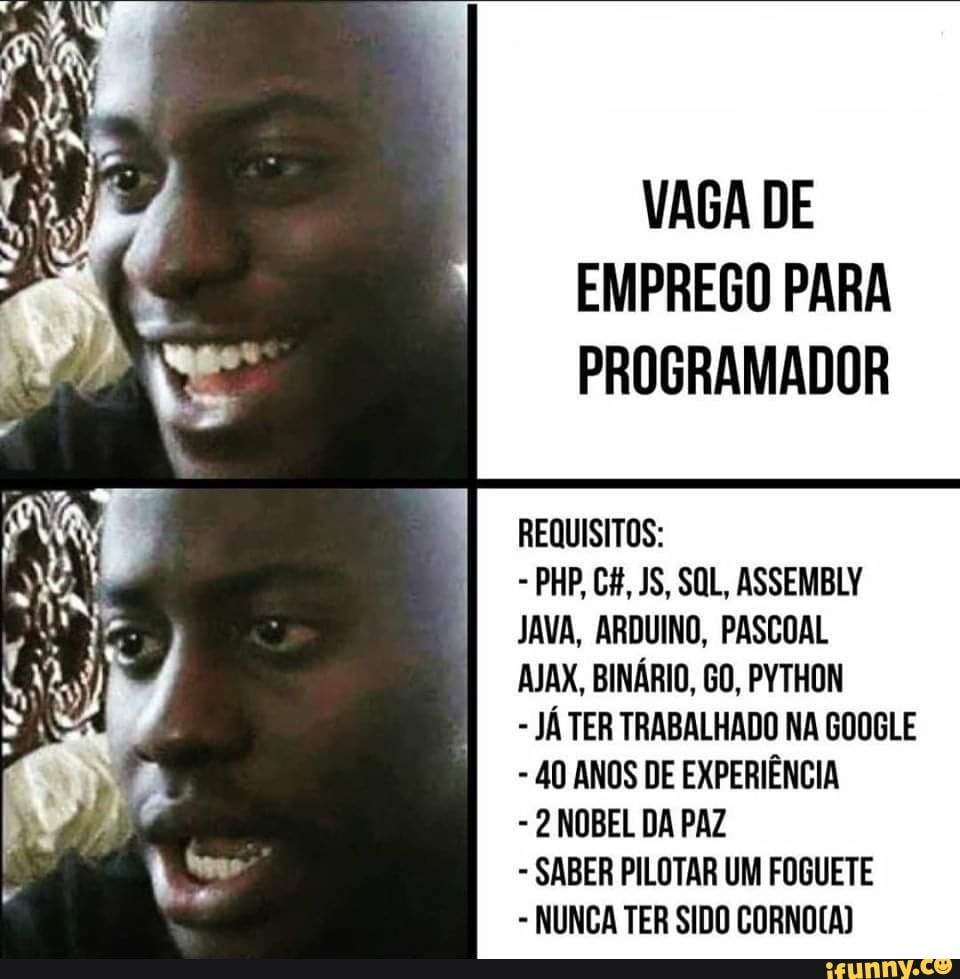

# Treinando React

Após ter aprendido Python, essa imagem é a que mais define minha visão sobre Java:

  

 
Comecei esses respositório com o objetivo de aprender Java, e treinar sua sintaxe para um projeto que estou envolvido. Dado que por enquanto, planejamos inicializar duas interfaces, uma leve para computadores Positivos(Minha nova definição para merda)  e uma mais pesada que seria para Electron.

  

 
Este repositório contém scripts e exemplos de código relacionados ao Java. Os scripts fornecidos aqui são apenas para treinar a sintaxe e o uso de bibliotecas, não são funcionais por si só, embora a logica esteja certa. 

Usei o VS Code justamente pelo TabNine(essa ferramenta foi a melhor coisa desde o pão de forma fatiado) e também usei o Gemini e o ChatGPT para estudos, dado que eles fornecem códigos robustos, mas você perde 90% do tempo livre debugando. Os scripts e conteudo foram baseados no W3School e estudei a logica realmente util, implementando modelos de validação de dados, threads e concorrência, filas, etc. Dado que saber que carros tem rodas é tão util quanto retrovisor em moto. 

  

## Estrutura do Repositório

Basicamente criei varias classes e os exemplos são nomes autoexplicativos, em que analizei a função de cada um, e embora não esteja terminado os scripts, dado que terminei o modulo Java da plataforma, quero recomeçar o jogo com todos os items e no level 80, atualizando e aplicando os conceitos aprendidos.

  

## Conceitos usados

- Validação de dados e credenciais;
- Regex;
- Concorrencia e paralelismo;
- Dicionarios, HashMap, LinkedList e tudo que faz uma pessoa chorar a noite;
- Todos os tipos de classes (literalmente agora o mundo é apenas 0 e 1 para mim);
- Como chorar em silêncio e ter burnout;

  

